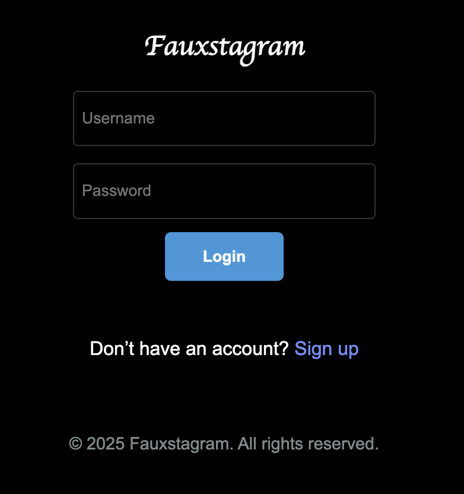
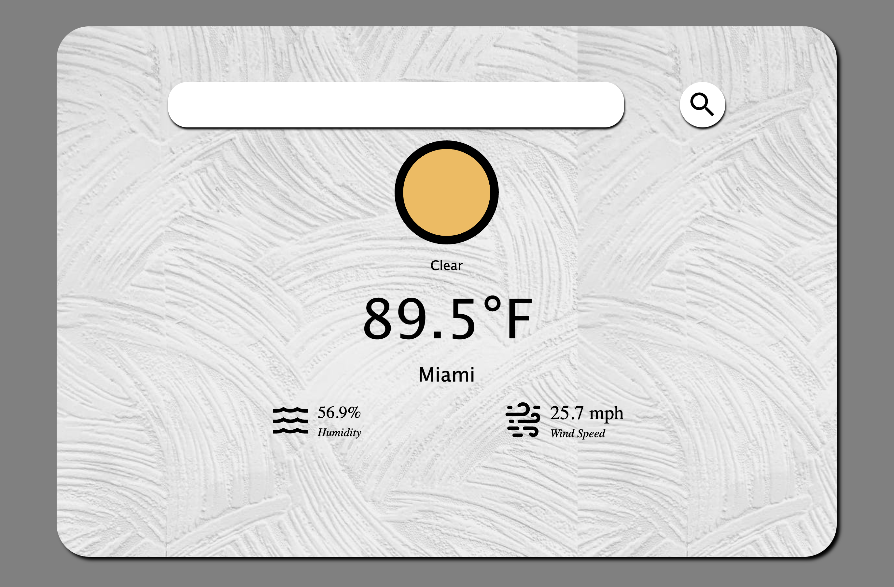

# 👋 Hi, I'm Kimball Oyler  

💻 Full-stack developer focused on building clean, efficient, and user-friendly applications.  
🌱 Currently sharpening my skills with **Node.js, Express, PostgreSQL, React, and Prisma**.  
🚀 Driven to create impactful projects that balance performance, accessibility, and great design.  

---

## 🛠️ Tech Stack
- **Languages:** JavaScript, SQL, HTML, CSS  
- **Backend:** Node.js, Express, Prisma, PostgreSQL  
- **Frontend:** React (Vite), EJS, Vanilla CSS  
- **Tools & Platforms:** Git, GitHub, Netlify, Render, Railway, Supabase, Cloudinary  

---

## 📂 Featured Projects  

### 📸 Fauxstagram  
An Instagram-style social app with authentication, image uploads, comments, and member-only features.  

👉 [Live Demo](https://fauxstagram.netlify.app) | [GitHub Repo](https://github.com/koyler88/odin-book)  

---

#### 🔹 Preview  

### 🌦️ Weather App  
A weather dashboard that fetches live weather data from an external API and displays current conditions.  

👉 [Live Demo](https://koyler88.github.io/Weather-App/) | [GitHub Repo](https://github.com/koyler88/weather-app)  

---

#### 🔹 Preview  

### 🛒 Shopping Website  
An e-commerce platform featuring product browsing, cart management, and a checkout flow.  

👉 [Live Demo](https://kso-shopping-cart.netlify.app/) | [GitHub Repo](https://github.com/koyler88/shopping-cart)  

#### 🔹 Preview  

---

## 📫 Connect with Me  
- Email: **88ksoyler88@gmail.com**  
